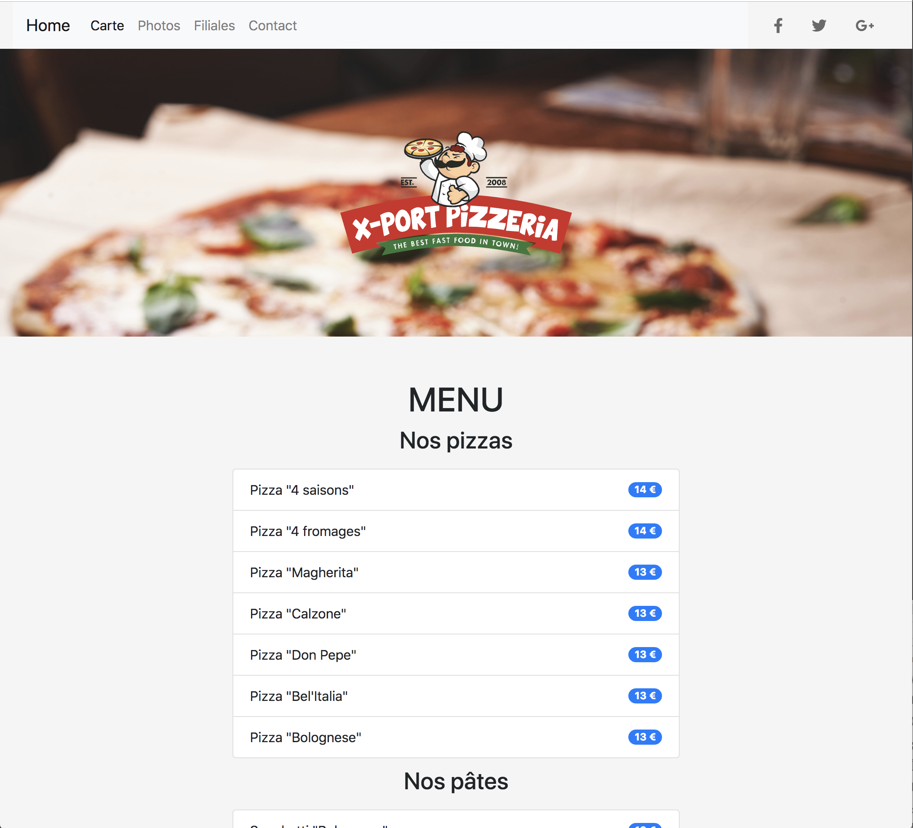

# Exercice Bootstrp - CSS - Framework

Créer un site vitrine d'une franchise fictive de restaurants.
Le site doit être responsive : au moins pour les petits écrans (xs) et les écrans moyens (md)
Minimum 5 pages accessibles par une barre de navigation (navbar) présente sur toutes les pages et menant aux différentes rubriques : Accueil, Carte, Photos, Restaurants, Contact.

**A quoi ça ressemble ?** 

https://kodok-hugues.github.io/bootstrap-css-framework/.

## Remarques:
Difficulté avec lightbox

 
